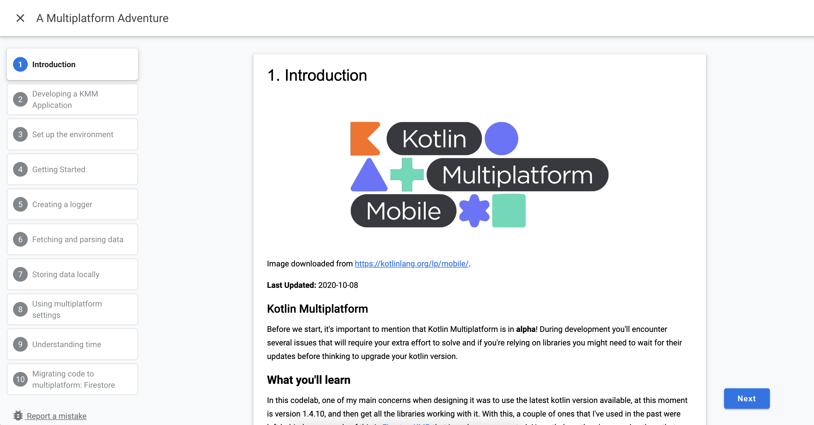

# KMP and KMM Codelabs

Kotlin Multiplatform is here! 🙌

I've created a codelab where you can follow step by step the development of android and iOS application using Kotlin Multiplatform:

👉 [Codelab](https://cmota.github.io/kmp-codelabs/)

👉 [Source Code](https://github.com/cmota/kmm-a-multiplatform-adventure)

👉 [Presentation](https://speakerdeck.com/cmota/a-multiplatform-adventure)

<h3 align="center">
  
</h3>
